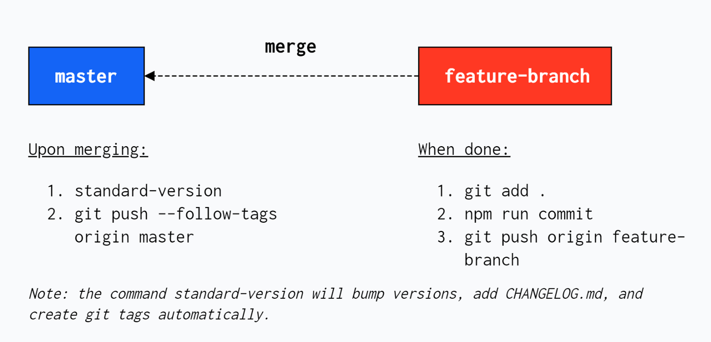

## Roc [Todo]
Link to Wiki Documentation


## Releasing
A summary of development workflow with standard-version involving multiple git branches.

<p align="center">
  
</p>

#### 1. **[feature-branch]** Stage modified files using:
```
git add .
```

#### 2. **[feature-branch]** Commit the files using git-cz package:
```
npm run commit
```

#### 3. **[feature-branch]** Now that all files have been committed, they are ready to be pushed to the remote:
```
git push origin <feature-branch>
```

#### 4. **[Bitbucket]** Create a Pull Request to master branch.

#### 5. **[master]** After it is merged, the following steps are done within the master branch:
- Run the command npm run release (which will bump versions based on commit types, add commit descriptions to CHANGELOG.md, and create git tags according to the current version).
- Push changes and git tags to master branch using:
```
git push --follow-tags origin master
```